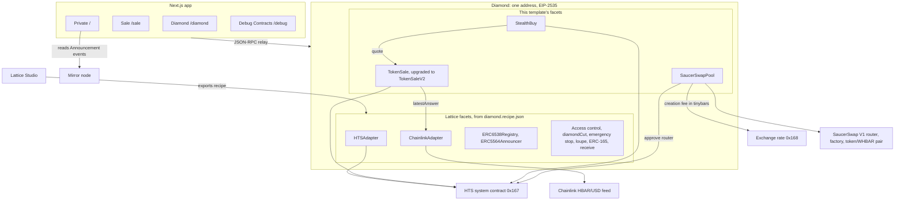
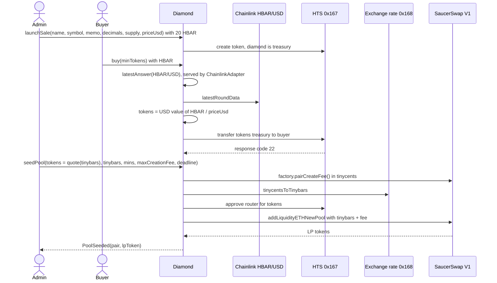
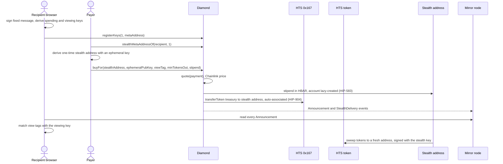

# Lattice Hedera Template

A [Scaffold-HBAR](https://docs.hedera.com/solutions/tools/scaffold-hbar/index) template for launching a token on Hedera. One [Lattice](https://github.com/dadadave80/lattice) diamond (an EIP-2535 upgradeable contract) creates an HTS token, sells it for HBAR at a USD price read from Chainlink's HBAR/USD feed, delivers purchases privately to one-time ERC-5564 stealth addresses that Hedera creates in the same transaction, and moves the sale into a SaucerSwap V1 pool at that same price. You upgrade it while it runs, and you choose its Lattice modules in Lattice Studio, a visual editor.

```bash
npm create scaffold-hbar@latest -- --template dadadave80/lattice-hedera-template
```

## What you get

- **A token sale priced in USD.** `launchSale` creates an HTS token with the diamond as treasury. `buy` prices every purchase from Chainlink HBAR/USD, so the price holds in dollars while HBAR moves.
- **Graduation to a DEX.** `seedPool` creates the token/WHBAR pool on SaucerSwap V1 from the diamond's own tokens and sale proceeds, opens it at the sale's price, and keeps the LP tokens.
- **Upgrades in place.** One `diamondCut` swaps the code behind the sale. The address, the token and the balances stay.
- **Private delivery.** `buyFor` sends tokens to a one-time [ERC-5564](https://eips.ethereum.org/EIPS/eip-5564) stealth address that has no account yet. Hedera creates and associates it in the same transaction. The recipient finds and sweeps it from the Private page.
- **Composed from a recipe.** Every Lattice facet is listed in `packages/foundry/diamond.recipe.json`, which Lattice Studio opens, edits and exports.
- **Tested without a chain.** Forge, Node and Vitest suites run against mocks of HTS and the feed.
- **An agent briefing.** [`AGENTS.md`](AGENTS.md) gives coding agents the rules that are easy to get wrong.



## Live on testnet

The app talks to this diamond until you deploy your own. Anyone can buy on it; its admin actions need its admin key, so try those on your own deployment. Every contract behind it is verified on Sourcify, so HashScan shows its source.

| What | Where |
| --- | --- |
| Diamond | [`0x4Eb94355872aB90ab258B940eE98B706dC9B2aa9`](https://hashscan.io/testnet/contract/0x4Eb94355872aB90ab258B940eE98B706dC9B2aa9) |
| Diamond creation transaction | [`0x2f19856bb704bbd940e9415ea31423e87fb4e53d3a70c7d106400d5071642ca2`](https://hashscan.io/testnet/transaction/0x2f19856bb704bbd940e9415ea31423e87fb4e53d3a70c7d106400d5071642ca2) |
| HTS token the diamond created (LST) | [`0x0000000000000000000000000000000000A59b36`](https://hashscan.io/testnet/token/0x0000000000000000000000000000000000A59b36) |
| A purchase priced by Chainlink | [`0xa3e016063a4eefafb6773540c1f5b6efb898abd3eab72bac92356b6bb9e62cc9`](https://hashscan.io/testnet/transaction/0xa3e016063a4eefafb6773540c1f5b6efb898abd3eab72bac92356b6bb9e62cc9) |
| Upgrade to `TokenSaleV2` (`diamondCut`) | [`0xe0720ff59f10e754f01e34c5633b6e31d9fef2e9028c7f1568a2a40a0b4cfd1f`](https://hashscan.io/testnet/transaction/0xe0720ff59f10e754f01e34c5633b6e31d9fef2e9028c7f1568a2a40a0b4cfd1f) |
| `TokenSaleV2` facet the diamond runs now (a NatSpec-only redeploy, swapped in by a later Replace cut) | [`0xB6391868E9A471129467c6a86312b9D34d9072a0`](https://hashscan.io/testnet/contract/0xB6391868E9A471129467c6a86312b9D34d9072a0) |
| `seedPool`: pool opened at the sale's price | [`0x8a1b853048fe2211757d30f5a416440c8214517b3adefade6bac03fc9d5fa103`](https://hashscan.io/testnet/transaction/0x8a1b853048fe2211757d30f5a416440c8214517b3adefade6bac03fc9d5fa103) |
| The LST/WHBAR pair | [`0xD746512855f8677fb2fce52c5B22A734451bef6D`](https://hashscan.io/testnet/contract/0xD746512855f8677fb2fce52c5B22A734451bef6D) |
| `buyFor` to a stealth address | [`0x33d9fd88062301e4607b1438c0f45e6bf731294ad6901f55d8cb2da75ae26006`](https://hashscan.io/testnet/transaction/0x33d9fd88062301e4607b1438c0f45e6bf731294ad6901f55d8cb2da75ae26006) |
| The stealth account it created | [`0xE34b6e5Ac8FEc6e07c3Fc5846E53A444CFCfC326`](https://hashscan.io/testnet/account/0xE34b6e5Ac8FEc6e07c3Fc5846E53A444CFCfC326) |
| The sweep, signed by the stealth account | [`0x70f7a839d211ed29ad559f13e38ed8f61283e4757385653b8c55ee15964fbbad`](https://hashscan.io/testnet/transaction/0x70f7a839d211ed29ad559f13e38ed8f61283e4757385653b8c55ee15964fbbad) |
| A diamond composed in Lattice Studio, `HTSAdapter` on the canvas | [`0xFDd6e099fF4b48a9179443A9D846AfA816997e23`](https://hashscan.io/testnet/contract/0xFDd6e099fF4b48a9179443A9D846AfA816997e23) |
| The HTS token that Studio diamond created | [`0x0000000000000000000000000000000000a5B060`](https://hashscan.io/testnet/token/0x0000000000000000000000000000000000a5B060) |

This diamond predates private purchases and the pool. It got `StealthBuy` (with `ERC6538Registry` and `ERC5564Announcer`) and `SaucerSwapPool` by the cuts in [Add a feature to an older diamond](#add-a-feature-to-an-older-diamond).

## Prerequisites

- [Node.js](https://nodejs.org/) 20.18.3 or newer, [Yarn](https://yarnpkg.com/) (the repo pins Yarn 3; run `corepack enable` once) and [Git](https://git-scm.com/).
- [Foundry](https://getfoundry.sh/). Deploying needs Foundry 1.7.1: Foundry 1.8 fails against Hedera's relay with `-32602 Invalid parameter 1` ([relay issue 5826](https://github.com/hiero-ledger/hiero-json-rpc-relay/issues/5826)). Building and testing work on any recent Foundry.
  ```bash
  foundryup --install v1.7.1
  ```
- Testnet HBAR from the [Hedera Portal faucet](https://portal.hedera.com/faucet): 10 HBAR a day without an account, 100 with one. Trying the app needs 5 HBAR for the private walkthrough, 10 to also buy on the Sale page. Deploying your own diamond and launching its sale needs about 80.

## Quick start

After scaffolding:

```bash
cd <your-project>
yarn foundry:test   # contracts and scripts against mocks, no chain needed
yarn next:test      # frontend unit tests
yarn next:dev       # http://localhost:3000, against Hedera testnet
```

No deploy needed: the app is wired to the reference diamond in [Live on testnet](#live-on-testnet). Use MetaMask on Hedera Testnet (chain 296, RPC `https://testnet.hashio.io/api`) or the built-in burner wallet, and fund it from the faucet by its 0x address.

| Page | What it does |
| --- | --- |
| **Private** (`/`) | Register to receive privately, buy for someone else to a stealth address, and the Inbox that finds and sweeps deliveries. |
| **Sale** (`/sale`) | Associate and buy. The admin card launches the sale. The SaucerSwap pool card shows the pool's price next to the sale's and gives the admin the seeding form. |
| **Diamond** (`/diamond`) | Every facet and the functions it serves, the Lattice Studio card, and the upgrade tool. |
| **Debug Contracts** (`/debug`) | Call any function of the diamond. |

To buy, open **Sale**, click **Associate** if it shows, enter HBAR and click **Buy**.

Try a private purchase with one wallet. Buying for yourself shows the flow, not the privacy.

1. On **Private**, connect a wallet holding about 5 HBAR.
2. **Receive privately**: **Sign to derive your keys**, then **Register**.
3. **Buy for someone privately**: paste your connected address in **Recipient**, enter 2 HBAR in **Pay with HBAR**, keep the 1 HBAR stipend, and click **Buy privately**.
4. The **Inbox** lists the delivery within a minute. Enter an address nothing ties to you, not the connected wallet, and click **Sweep**. A new address works: creating its account costs about 0.67 HBAR of the stipend.

## Deploy your own diamond

1. `yarn foundry:account:generate` asks for a keystore name and a password, and prints the address. Remember both; `<your keystore>` below is that name.
2. Fund the address with about 80 HBAR from the [faucet](https://portal.hedera.com/faucet).
3. `yarn foundry:deploy --network hedera_testnet` asks you to pick the keystore (or pass `--keystore <name>`) and unlock it.

The deploy:

1. deploys the recipe's Lattice facets (reusing any already at their deterministic addresses) and adds `TokenSale`, `StealthBuy` and `SaucerSwapPool`;
2. creates the diamond in one transaction, with your account as admin and the network's SaucerSwap V1 addresses;
3. registers the Chainlink HBAR/USD feed and makes your account an emergency guardian;
4. rewrites `packages/nextjs/contracts/deployedContracts.ts`, so the app switches to your diamond. It builds that file from the records in `packages/foundry/deployments/`, which are git-ignored: commit `deployedContracts.ts` or redeploy from each checkout;
5. verifies every new contract on Sourcify. A failed verification prints the retry command and does not fail the deploy.

A first deployment sends up to 26 transactions and costs up to 60 HBAR. Then create the token. From the **Admin** card on the Sale page: import the deployer's private key into your browser wallet (`yarn foundry:account:reveal-pk` prints it; testnet only) and connect with it. Or from the terminal:

```bash
# name, symbol, memo (may be empty), decimals, supply in smallest units, priceUsd with 18 decimals
cast send <your diamond> \
  "launchSale(string,string,string,int32,int64,uint256)" \
  "My Token" MTK "" 8 100000000000000 50000000000000000 \
  --value 20ether --gas-limit 1000000 --legacy \
  --rpc-url https://testnet.hashio.io/api --account <your keystore>
```

That creates 1,000,000 MTK (10^14 units at 8 decimals) at $0.05 each. The 20 HBAR covers the token creation fee. Hedera keeps only the fee ([HIP-358](https://hips.hedera.com/hip/hip-358)), and the admin can withdraw the rest. The token is created in its own transaction because `forge script` simulates locally first, and no local EVM runs HTS.

## How it works

Every function of every facet is served at the diamond's address. Facets hold no state: each one forwards to a library that keeps its storage at its own [ERC-7201](https://eips.ethereum.org/EIPS/eip-7201) slot, so a cut replaces code without touching storage.

| File | What it is |
| --- | --- |
| `packages/foundry/diamond.recipe.json` | The Lattice facets and their init steps, in Lattice Studio's format. |
| `packages/foundry/script/DeployDiamond.s.sol` | Builds the diamond from the recipe and appends this template's facets. Holds the feed and SaucerSwap addresses per network. |
| `packages/foundry/contracts/LatticeFacets.sol` | The Lattice facets compiled into the project. A recipe can name only these. |
| `packages/foundry/contracts/libraries/TokenSaleLib.sol` | The sale's logic and storage. |
| `packages/foundry/contracts/libraries/StealthBuyLib.sol` | Private purchases. It books into the sale's storage. |
| `packages/foundry/contracts/libraries/SaucerSwapPoolLib.sol` | `seedPool`, `transferLiquidity` and `poolInfo`. |
| `packages/nextjs/utils/` | Unit conversion, cut planning, stealth-address math, pool price math, each with tests. |

Full file map and the rules agents must follow: [AGENTS.md](AGENTS.md).

### Sale and graduation



- **Pricing.** `buy`, `buyFor` and `quote` read the feed through the diamond's `latestAnswer(bytes32)`. `ChainlinkAdapter` rejects a stale, non-positive or incomplete answer, so a bad answer stops a purchase instead of mispricing it. The staleness limit defaults to 365 days on testnet, where the feed has no guaranteed heartbeat, and 25 hours on mainnet; `HBAR_USD_MAX_STALENESS` (seconds) overrides it at deploy time. A purchase rounds down to whole token units; the remainder stays as proceeds.
- **Graduation.** `seedPool(tokens, tinybars, minTokens, minTinybars, maxCreationFee, deadline)` is admin only. It pays from the diamond's HBAR balance, sale proceeds included, plus any HBAR sent with the call. A new pool opens at exactly `tinybars`:`tokens`; pass `tokens = quote(tinybars)` to open at the sale's price. With a pool, the router adds at the pool's ratio and the minimums bound it. The diamond keeps the LP tokens; `transferLiquidity(to, amount)` moves them to an associated account. `poolInfo()` returns the pair, reserves, LP balance and today's creation fee.
- **Emergency stop.** A guardian halts `buy`, `buyFor` and `seedPool` with `emergencyStop(reason)`; an admin resumes with `emergencyResume()`. `withdrawProceeds` and `transferLiquidity` still work.

### Private purchases



- **Register.** The recipient signs one fixed message. The app derives the keys from the signature, keeps them in the tab, and registers the meta-address on the diamond's [ERC-6538](https://eips.ethereum.org/EIPS/eip-6538) registry. A payer can also paste a meta-address (`st:<chain>:0x…`) for someone who never registered.
- **Buy.** `buyFor` prices the payment, not the stipend, with the diamond's own `quote`, so it pays the same rate and bonus as `buy`. It sends the stipend, transfers the tokens, and emits ERC-5564's `Announcement` (scheme 1) and `StealthDelivery`. Indexers that count sales read both `TokensPurchased` and `StealthDelivery`; `saleInfo` totals include both.
- **Sweep.** The sweep is the stealth account's first transaction, and the stipend pays its gas: about 0.035 HBAR to an existing account, about 0.67 HBAR to a new one. That is why the stipend defaults to 1 HBAR. The sweep moves tokens only; the rest of the stipend stays behind.
- **Gas.** `buyFor` takes about 1.45 million gas. The app sets a 2,000,000 limit, and the payer must hold the full limit's worth.

Privacy model:

- **Hidden:** which registered recipient a stealth address belongs to.
- **Public:** the payer, the amount, the time, and that a delivery happened. The anonymity set is everyone registered on this diamond, which is small on a new one.
- **Sweeping to the registering wallet**, or anything tied to it, re-links the delivery. The Inbox warns when the destination is the connected wallet.
- **The keys come from a signature.** Anyone who can make the wallet sign the same message can find and spend every delivery.
- **The Inbox matches announcements in the browser**, so the mirror node does not learn which deliveries are yours. The app's JSON-RPC endpoint and `/api/hedera/account` route do see the stealth addresses a browser asks about.
- **Anyone can announce.** The Inbox keeps the first announcement per stealth address and uses the sale's token, not the one an announcement names.

### Hedera specifics

| Point | How the template handles it |
| --- | --- |
| HBAR has two units | Contracts see tinybars (8 decimals) in `msg.value`. A JSON-RPC transaction's `value` is weibars (18 decimals), and the relay converts. The app converts only in `utils/sale/units.ts`. With `cast`, `--value 20ether` sends 20 HBAR. |
| HTS returns response codes | `22` is success. Every call to `0x167` is checked and reverts with a named error, as `TokenSaleLib._transferFromTreasury` does. |
| Association | An account associates once at the token's address ([HIP-719](https://hips.hedera.com/hip/hip-719)), or on its first purchase if it has a free automatic slot ([HIP-904](https://hips.hedera.com/hip/hip-904)). Accounts created from an EVM address have unlimited slots. Otherwise `buy` reverts `TokenSaleBuyerNotAssociated`. |
| Lazy-created accounts | HBAR sent to an address with no account creates a hollow account, with no key until its first signed transaction ([HIP-583](https://hips.hedera.com/hip/hip-583)) with unlimited automatic associations. `buyFor` and the sweep rely on this. |
| Token keys on a diamond | Facets run under `delegatecall`, so Lattice's `HTSAdapterLib` sets the admin and supply keys as `delegatableContractId`. |
| Pool creation fee | SaucerSwap prices it in tinycents (10^-8 US cents). The diamond converts it with the exchange-rate system contract at `0x168` in the same transaction that pays it, and refuses it above `maxCreationFee`. |
| No local chain | Tests run against Lattice's `MockHederaTokenService` and a mock feed. The app runs against testnet. |

## Upgrade your diamond

Only the diamond's admin can cut it, so this applies to the diamond you deployed. `TokenSaleV2` is `TokenSale` with a 5% bonus and one new function, `bonusBps()`.

1. Deploy the facet. Nothing changes yet:
   ```bash
   yarn foundry:deploy --file DeployTokenSaleV2.s.sol --network hedera_testnet
   ```
2. Open the **Diamond** page with the admin wallet, paste the `TokenSaleV2` address the deploy printed into the upgrade card, and click **Preview cut**. Expect six functions replaced and one (`bonusBps`) added.
3. Click **Cut into the diamond**.

The sale now quotes 5% more, private purchases included. The address, token, price, totals and balances are unchanged; `test/TokenSaleUpgrade.t.sol` asserts it. Run step 1 in the checkout that deployed the diamond; elsewhere the regenerated `deployedContracts.ts` loses `Diamond` and the app stops finding it.

To ship your own change, copy `TokenSaleV2.sol`, change it, list its selectors in `exportSelectors()`, then deploy and cut it the same way. Only append fields to a storage struct, and never change a slot. The upgrade card plans Add and Replace cuts only; a function the new facet drops stays routed to the old one until you send a Remove cut.

A function added by a cut, such as `bonusBps()`, is not in the generated `Diamond` ABI; read it with an inline ABI, as `SaleCard.tsx` does.

### Add a feature to an older diamond

A diamond deployed from the current scripts already has private purchases and the pool. One deployed before them gets each with one cut from its admin:

```bash
yarn foundry:deploy --file DeployStealthBuy.s.sol --network hedera_testnet
yarn foundry:deploy --file DeploySaucerSwapPool.s.sol --network hedera_testnet
```

Each script reads the diamond from `packages/foundry/deployments/diamond/<chainId>.json`, deploys the facets and initializers, and cuts them in, running the initializers through `UpgradeMultiInit`. It then adds the facets to the deployment record so the regenerated ABI lists them. On a diamond deployed from the current scripts, these cuts revert.

## Customize in Lattice Studio

The Lattice part of the diamond is this list in `packages/foundry/diamond.recipe.json`, plus init steps `ChainlinkAdapterInit`, `HTSAdapterInit`, `ERC6538RegistryInit` and `ERC5564AnnouncerInit`:

```json
"facets": ["ChainlinkAdapter", "HTSAdapter", "ERC5564Announcer", "ERC6538Registry", "AccessControlDiamondCut", "EmergencyStop", "AccessControl", "Receive", "DiamondLoupeFacet", "ERC165Facet"]
```

[Lattice Studio](https://lattice-studio-git-feat-hedera-david-dadas-projects.vercel.app/) (a preview build of Studio's `feat/hedera` branch) composes Lattice diamonds on a canvas and checks selectors, storage, initializers and upgrade authority as you edit. Its Hedera build deploys to Hedera Testnet, and its catalog `dev-6c8db45` carries Lattice's Hedera and stealth-address facets.

1. Run `yarn diamond:studio` and open the link. The recipe travels in the link; nothing is uploaded.
2. Change it, for example replace `ChainlinkAdapter` with `PythAdapter`.
3. Export `recipe.json` and save it over `packages/foundry/diamond.recipe.json`.
4. Run `yarn foundry:test`, then `yarn foundry:deploy --network hedera_testnet`. This deploys a new diamond; change a live one with a cut.

Rules:

- **`TokenSale`, `StealthBuy` and `SaucerSwapPool` stay out of the recipe.** Studio rejects facets it does not know. `DeployDiamond.s.sol` appends them.
- **Keep `HTSAdapter` and `HTSAdapterInit`.** The sale creates its token with the roles `HTSAdapterInit` grants, and the deploy stops without them.
- **Keep `ERC6538Registry`** for private purchases. The deploy does not check for it.
- **Swapping the oracle leaves `TokenSale` alone**, since it reads `latestAnswer(bytes32)`. Registering and pushing a Pyth feed (`registerFeed`, `updatePriceFeeds`) is yours to add.
- **A facet must be compiled in before a recipe names it.** `ChainlinkAdapter`, `HTSAdapter`, `PythAdapter`, `ERC6538Registry`, `ERC5564Announcer`, `Pausable`, `Multicall` and the base facets are. For another, add its import and its initializer's to `contracts/LatticeFacets.sol`, and if its initializer takes anything other than no argument or a single `admin`, an encoder in `_initStep` in `DeployDiamond.s.sol`.

A diamond without the sale needs no Solidity: deploy it from Studio, as the Studio diamond in [Live on testnet](#live-on-testnet) was.

The **Lattice Studio** card on the Diamond page goes the other way: it names the live diamond's facets from Studio's catalog and links to Studio with them on the canvas.

The deploy stops before sending anything when a recipe cannot be built:

| Message | Fix |
| --- | --- |
| `X is in the recipe but not compiled into this project` | Import `X` in `contracts/LatticeFacets.sol`. |
| `X is not in FacetInventory` | `X` is not a Lattice facet. Remove it. |
| `TokenSale creates its token through HTSAdapter` | Add `HTSAdapter` and `HTSAdapterInit`. |
| `selector 0x… is exported by both A and B` | Give the selector one owner in Studio. |
| `XInit takes arguments this template cannot encode yet` | Add an encoder in `_initStep`. |
| `init.kind must be 'steps' or 'none'` | Use init steps, not a bundle. |
| `only {"$ref": "deployer"} is supported` | Replace `{"$ref": "self"}` with an address. |

## Add your own facet

1. Write an interface, a library with its own ERC-7201 slot, and a facet that forwards to it, as `ITokenSale`, `TokenSaleLib` and `TokenSale` do. Name each file after its contract; the ABI build reads `out/<Name>.sol/<Name>.json`.
2. Diamonds route by selector, and the deploy script and upgrade card read each facet's list from `exportSelectors()` (ERC-8153). Return every selector except `exportSelectors()` itself from `exportSelectors()`. `forge inspect <Facet> methodIdentifiers` lists them, and `_assertExportsItsAbi` in `test/SaleTestBase.sol` fails when they disagree.
3. For new deployments, add it next to `TokenSale` in `build()` in `DeployDiamond.s.sol` and raise `HEDERA_FACETS` (and `HEDERA_INITS` if it has an initializer). For a live diamond, deploy it and cut it from the Diamond page, or with a script like `DeployStealthBuy.s.sol` if it has an initializer.
4. Test it through the diamond, extending `SaleTestBase`.

`cast index-erc7201 "<namespace>"` prints a namespace's slot. Price through `ITokenSale(address(this)).quote(tinybars)` to get the live rate and any bonus, and pay out with `TokenSaleLib._transferFromTreasury`.

## Launch on mainnet

The same contracts and scripts deploy to Hedera mainnet (chain 295). The deploy script picks the mainnet feed and SaucerSwap addresses by chain id. You need a funded mainnet account (`yarn foundry:account:generate` or `yarn foundry:account:import`) and a passing `yarn foundry:test` on the code you deploy. The deploying account becomes admin of everything the diamond holds.

| | Testnet | Mainnet |
| --- | --- | --- |
| Network flag | `--network hedera_testnet` | `--network hedera_mainnet` |
| Relay | `https://testnet.hashio.io/api` | `https://mainnet.hashio.io/api` |
| Chainlink HBAR/USD | `0x59bC155EB6c6C415fE43255aF66EcF0523c92B4a` | [`0xAF685FB45C12b92b5054ccb9313e135525F9b5d5`](https://hashscan.io/mainnet/contract/0xAF685FB45C12b92b5054ccb9313e135525F9b5d5) |
| Feed staleness default | 365 days | 25 hours (24-hour heartbeat plus 1 hour) |
| SaucerSwap V1 router | `0.0.19264` | `0.0.3045981` |
| SaucerSwap V1 factory | `0.0.9959` | `0.0.1062784` |
| WHBAR | `0.0.15058` | `0.0.1456986` |
| Pool creation fee | $2 | $50 |
| Verify one contract | `yarn foundry:verify:testnet` | `yarn foundry:verify:mainnet` |

The SaucerSwap addresses are its current ones ([contracts](https://docs.saucerswap.finance/developers/contracts)). Its older routers and old WHBAR are deprecated.

1. **Deploy.** Override the staleness limit only with `HBAR_USD_MAX_STALENESS` in `packages/foundry/.env`; 86,400 exactly stops purchases whenever an update is late.
   ```bash
   yarn foundry:deploy --network hedera_mainnet
   ```
   The record lands in `packages/foundry/deployments/diamond/295.json`. `deployedContracts.ts` is rebuilt only from records on this machine, so an app serving both networks must deploy both from one checkout.
2. **Launch the sale** with the `launchSale` command above and `--rpc-url https://mainnet.hashio.io/api`. Token creation costs $1, about 10 HBAR; 20 HBAR leaves room. Keep the name short if you will open a pool: the LP token is named after both tokens, and HTS caps names at 100 characters.
3. **Point the app at mainnet.** In `packages/nextjs/scaffold.config.ts`, set `const targetNetworks = [chains.hedera] as const satisfies readonly [chains.Chain, ...chains.Chain[]];`. In `components/ScaffoldHbarAppWithProviders.tsx`, change `initialChain={hederaTestnet}` to `hedera`. In `packages/nextjs/.env`, set `NEXT_PUBLIC_WALLET_CONNECT_PROJECT_ID`, and optionally `NEXT_PUBLIC_HEDERA_MAINNET_RPC_URL` and `HEDERA_MIRROR_MAINNET_URL`. Then `yarn next:build`.
4. **Seed the pool (optional).** The SaucerSwap pool card on the Sale page sets the amounts, minimums, fee margin and gas for you. From the terminal:
   ```bash
   RPC=https://mainnet.hashio.io/api
   DIAMOND=<your diamond>
   cast call $DIAMOND "poolInfo()((address,address,address,address,address,uint256,uint256,uint256,uint256,uint256))" --rpc-url $RPC  # last field: creation fee in tinybars
   cast call $DIAMOND "quote(uint256)(int64)" 100000000000 --rpc-url $RPC  # tokens for 1,000 HBAR
   cast balance $DIAMOND --rpc-url $RPC  # weibars: divide by 10^10 for tinybars, 10^18 for HBAR
   cast send $DIAMOND \
     "seedPool(int64,uint256,int64,uint256,uint256,uint256)" \
     <tokens> 100000000000 <99% of tokens> 99000000000 <105% of the fee> $(( $(date +%s) + 600 )) \
     --value 1500ether --gas-limit 12000000 --legacy \
     --rpc-url $RPC --account <your keystore>
   ```
   `--value 1500ether` sends 1,500 HBAR; send only what the diamond lacks. Set both minimums near 99% even for a new pool: anyone can create the pool first, at any price, and zero minimums revert `SaucerSwapPoolInvalidAmount`. Give the fee about 5% margin; its HBAR cost moves with the exchange rate. Give 12,000,000 gas; the relay underestimates HTS calls. The sender must hold that limit's worth, about 10 HBAR, though about 6 is charged.
5. **Hand over the keys.** `grantRole(bytes32,address)` `DEFAULT_ADMIN_ROLE` (32 zero bytes) and `HTS_MANAGER_ROLE` (`cast keccak HTS_MANAGER_ROLE`) to the account that will hold them, `addGuardian` for guardians you can reach quickly, then `removeGuardian` the deployer. Renounce last: check `hasRole` for the new holder, then `renounceRole(role, deployer)` each role from the deployer. Test the hand-over on testnet first.

Costs, at about $0.103 per HBAR on 2026-10-05:

| Step | Cost |
| --- | --- |
| Deploy, up to 26 transactions | up to about 60 HBAR |
| `launchSale` | $1 (about 10 HBAR) plus gas |
| `seedPool` on a new pool | $50 creation fee (about 485 HBAR), about 6 HBAR of gas, plus the liquidity |
| `buy` | about 800,000 gas on a buyer's first purchase (it associates them), about 100,000 after; under 1 HBAR |
| `buyFor` | about 1.2 HBAR plus the stipend |

Risks:

- **Nothing is audited.** Not this template, not Lattice (pre-1.0), and not how the diamond calls SaucerSwap.
- **The admin key controls everything:** cuts, proceeds, price, pool, LP tokens and the token's supply. A laptop keystore is a hot key.
- **The emergency stop is a pause, not an exit.** Ending the sale for good while keeping the pool needs a new `TokenSale` facet.
- **A stale feed stops the sale.** Resume once it updates.
- **The sale keeps selling after graduation.** When the pool's price rises above the sale's, buyers arbitrage from the sale into the pool, against the diamond's LP position, which also carries the usual AMM risk.

Testnet assumptions left in the app (none touch the contracts):

- `DiamondNotDeployed.tsx`, the `DeployStealthBuy` hint in `PrivatePurchases.tsx`, and the stop messages in `DeployDiamond.s.sol` and `DeploySaucerSwapPool.s.sol` suggest `--network hedera_testnet`.
- The Sale, Buy privately and Receive cards show the testnet faucet link on mainnet.
- `mirrorNodeUrl` in `utils/stealth/announcements.ts` picks the mirror node by chain id and has no environment override.

## Commands

| Command | What it does |
| --- | --- |
| `yarn foundry:test` | Forge tests against mock HTS and a mock feed, then the Node tests for `scripts-js`. |
| `yarn next:test` | Vitest unit tests for `packages/nextjs/utils`. |
| `yarn next:dev` | The app on `http://localhost:3000`. |
| `yarn next:build` | Production build of the app. |
| `yarn lint` | Lints the frontend and checks Solidity and script formatting. `yarn format` fixes it. |
| `yarn foundry:account:generate` | Creates a deployer keystore. |
| `yarn foundry:deploy --network hedera_testnet` | Deploys the diamond, regenerates the frontend's contracts and verifies on Sourcify. |
| `yarn foundry:deploy --file DeployTokenSaleV2.s.sol --network hedera_testnet` | Deploys the upgrade facet. |
| `yarn foundry:deploy --file DeployStealthBuy.s.sol --network hedera_testnet` | Adds private purchases to an older diamond. |
| `yarn foundry:deploy --file DeploySaucerSwapPool.s.sol --network hedera_testnet` | Adds the pool facet to an older diamond. |
| `yarn foundry:verify:testnet <address> <file>:<Contract>` | Verifies one contract by hand. `foundry:verify:mainnet` on mainnet. |
| `yarn diamond:studio` | Prints the Lattice Studio link for the recipe. |

Environment variables are optional. No private key goes in any `.env`; deploys sign with the keystore.

| Variable | File | Default |
| --- | --- | --- |
| `NEXT_PUBLIC_WALLET_CONNECT_PROJECT_ID` | `packages/nextjs/.env` | a shared demo ID; set your own for anything public |
| `NEXT_PUBLIC_HEDERA_TESTNET_RPC_URL`, `NEXT_PUBLIC_HEDERA_MAINNET_RPC_URL` | `packages/nextjs/.env` | hashio |
| `HEDERA_MIRROR_TESTNET_URL`, `HEDERA_MIRROR_MAINNET_URL` | `packages/nextjs/.env` | public mirror nodes, for `/api/hedera/account` only |
| `HBAR_USD_MAX_STALENESS` | `packages/foundry/.env` | 365 days on testnet, 25 hours on mainnet |

## Troubleshooting

| You see | Fix |
| --- | --- |
| `forge` cannot find `forge-std` or `@lattice` imports | Fetch the libraries: `git submodule update --init --recursive`. |
| `-32602 Invalid parameter 1` on deploy | Use Foundry 1.7.1: `foundryup --install v1.7.1`. |
| `Requested resource not found. address '0x…'` | The deployer has no Hedera account yet. Fund it from the faucet. |
| `Sender account not found` in the app | The wallet has never received HBAR. Fund it. |
| `DeployDiamond: this diamond needs Hedera` | You targeted a local chain. Use `--network hedera_testnet`. |
| `TokenSaleBuyerNotAssociated` | Click **Associate** on the Sale page. |
| `ChainlinkStaleData` | On testnet, the feed paused: register it again with a larger limit, `cast send <diamond> "registerFeed(bytes32,address,uint48)" $(cast format-bytes32-string "HBAR/USD") <feed> <seconds>` from the admin. On mainnet, `emergencyStop` (on a diamond with no guardian, `addGuardian` first) and resume when the feed updates. |
| `TokenSaleTransferFailed(178)` | `INSUFFICIENT_TOKEN_BALANCE`: the sale sold out. The admin mints more with `HTSAdapter`'s `mintToken`. |
| `HTSCallFailed` on `launchSale` | The HBAR sent did not cover the creation fee. Raise `--value`. |
| `INSUFFICIENT_GAS` on `buyFor` | Set `--gas-limit 2000000`. |
| `SaucerSwapPoolCreationFeeTooHigh`, `SaucerSwapPoolInsufficientHbar` or `INSUFFICIENT_GAS` on `seedPool` | Raise `maxCreationFee` to about 105% of `poolInfo().creationFee`, fund the diamond, or set `--gas-limit 12000000` (the pool card does; Debug Contracts cannot). |
| "No facet serves `seedPool`" or "This diamond does not sell privately yet" | The diamond predates the feature. See [Add a feature to an older diamond](#add-a-feature-to-an-older-diamond). |
| "No diamond on Hedera Mainnet" | Switch the wallet to Hedera Testnet, or deploy to mainnet. |

## Limits

- If `diamond.recipe.json` sets `admin` to an address other than the deploying account, the deploy skips feed registration and the guardian, and prints the `registerFeed` call for that admin. `launchSale` must then come from that admin.
- Lattice Studio's Hedera build is a preview of its `feat/hedera` branch, not a release.
- The Inbox scans every announcement since the diamond was created, one week per mirror node query, so scans slow as the diamond ages.
- Not built yet: a screen for `transferLiquidity` (use `cast`), sweeping the leftover stipend, and scheduled closes or vesting through the Hedera Schedule Service (`HSSAdapter` is in Lattice).

## Links

- [Lattice](https://github.com/dadadave80/lattice) and its [Hedera guide](https://github.com/dadadave80/lattice/blob/feat/hedera-system-contract-modules/docs/guides/hedera.md)
- [Lattice Studio](https://github.com/dadadave80/lattice-studio) ([`feat/hedera`](https://github.com/dadadave80/lattice-studio/tree/feat/hedera), [Hedera build](https://lattice-studio-git-feat-hedera-david-dadas-projects.vercel.app/))
- [Scaffold-HBAR docs](https://docs.hedera.com/solutions/tools/scaffold-hbar/index) and [create-scaffold-hbar](https://github.com/hedera-dev/create-scaffold-hbar)
- [Chainlink feeds on Hedera](https://docs.chain.link/data-feeds/price-feeds/addresses?network=hedera)
- [SaucerSwap docs](https://docs.saucerswap.finance/)
- [ERC-5564](https://eips.ethereum.org/EIPS/eip-5564), [ERC-6538](https://eips.ethereum.org/EIPS/eip-6538), [HIP-583](https://hips.hedera.com/hip/hip-583), [HIP-904](https://hips.hedera.com/hip/hip-904)

Contributions are welcome: see [CONTRIBUTING.md](CONTRIBUTING.md) and the [code of conduct](CODE_OF_CONDUCT.md). Report vulnerabilities privately as [SECURITY.md](SECURITY.md) describes.

MIT licensed. See [LICENCE](LICENCE).
